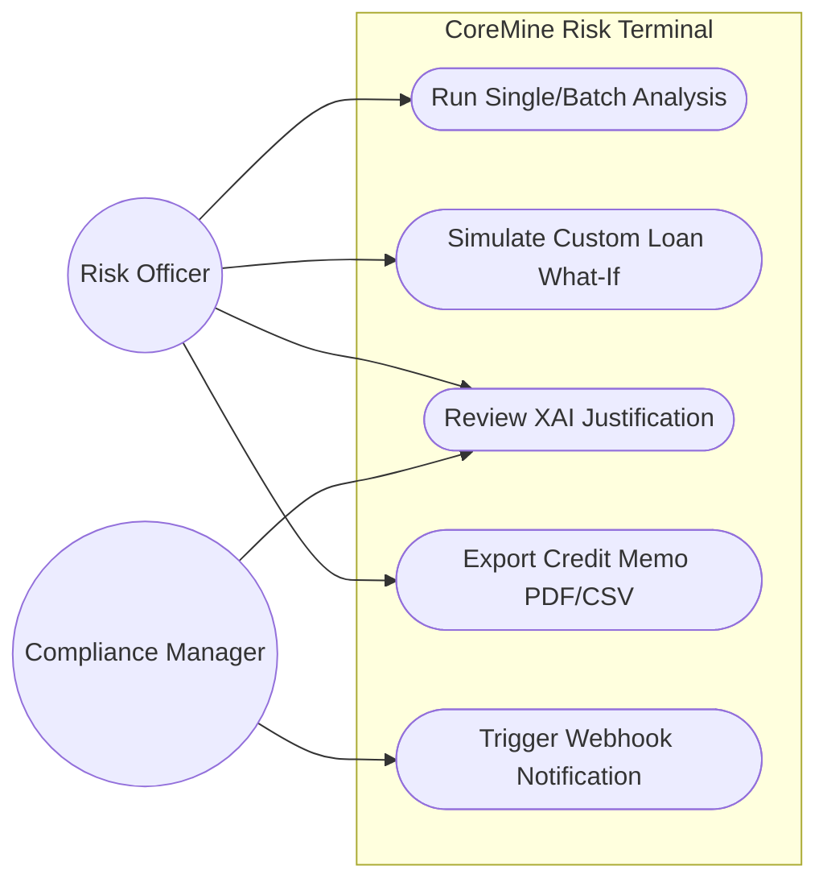
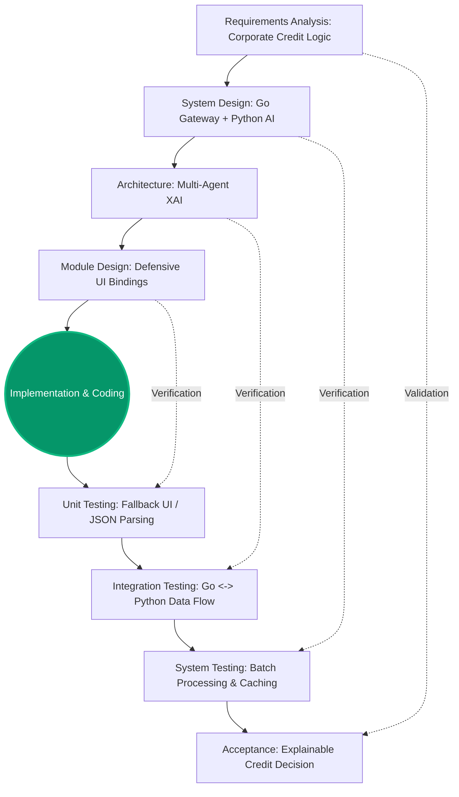

# CoreMine Risk
### Next-Gen B2B Credit Underwriting Terminal
> *Replacing black-box financial decisions with a dialectical Multi-Agent XAI Consensus Engine.*

[](https://opensource.org/licenses/MIT)
[](https://go.dev/)
[](https://www.python.org/)
[](https://react.dev/)

---

## Overview

CoreMine Risk is an Explainable AI (XAI) terminal designed to automate corporate credit underwriting. Unlike traditional AI models that function as black-boxes, CoreMine utilizes a dialectical approach. It forces distinct AI personas (e.g., Risk Auditor vs. Client Advocate) into a digital committee, demanding they debate financial telemetry before arriving at a consensus.

The result is a transparent, auditable, and B2B-ready corporate credit memo.

### Value Proposition
* **No More Black-Box:** The system outputs the exact debate and justification behind every approval or rejection.
* **Institutional Rigor:** Focuses on corporate cash flow, default risk, and Debt Service Coverage Ratio (DSCR) covenants rather than speculative market momentum.
* **Scale Ready:** Architecture supports both deep single-entity analysis and concurrent batch processing.

---
## Business & Market Strategy

* **Product Definition:** An enterprise-grade decision support system that orchestrates AI agents to simulate a corporate credit committee.
* **One-Sentence Value Proposition:** CoreMine Risk slashes the B2B credit underwriting process from 3 weeks to 15 seconds while replacing compliance-risky "black-box" AI with auditable, explainable consensus.
* **Target Audience (B2B):** Tier 1 & Tier 2 Banks, Institutional Lenders, and Corporate Risk Departments.
* **The Market Gap:** Current financial AI tools either summarize PDFs or predict stock prices. They fail in institutional lending because they lack **Explainability (XAI)**. A bank cannot legally deny a $50M loan by saying "The AI said no." 
* **Our Competitive Advantage (Moat):** We don't just prompt an LLM. We utilize a *Multi-Agent Dialectical Architecture*. By forcing a Risk Auditor and a Client Advocate to debate, we generate the mathematical and logical justification (XAI) required by financial compliance laws.
* 
## Key Features

* **Multi-Agent Consensus:** Decisions are forged through deliberate conflict between a Risk Auditor, a Client Advocate, and a Compliance Agent.
* **What-If Simulation:** A dynamic simulation engine allowing risk officers to stress-test custom loan amounts in real-time.
* **Batch Processing:** Concurrent screening of multiple corporate entities (e.g., AAPL, MSFT, TSLA) for rapid portfolio assessment.
* **Audit-Ready Export:** Native support for generating professional PDF memos and CSV datasets for legacy banking systems.
* **Enterprise Integration:** Real-time decision broadcasting via Slack/ERP webhooks.
* **High-Speed Caching:** SQLite-backed middleware ensuring sub-millisecond retrieval of historical analyses.

---

## Engineering Excellence

CoreMine Risk is architected adhering to strict Software Engineering disciplines and the V-Model SDLC standard.

<details>
<summary><b>View System Architecture & Use Cases</b></summary>
<br>

### Use Case Diagram


### Verification & Validation (V-Model)

</details>

---

## Quick Start

Deploy the system locally via Docker in under 60 seconds.

### 1. Clone the Repository
```bash
git clone [https://github.com/eyupefeaslan/CoreMine-Risk.git](https://github.com/eyupefeaslan/CoreMine-Risk.git)
cd CoreMine-Risk
```

### 2. Configure Environment
Create a `.env` file in the root directory:
```bash
# Gateway & AI Configuration
GEMINI_API_KEY=your_google_ai_studio_key
SLACK_WEBHOOK_URL=your_webhook_url
```

### 3. Launch with Docker
```bash
docker compose up --build
```
* **Client Interface:** `http://localhost:5173`
* **API Gateway:** `http://localhost:3030`

---

## Tech Stack

* **Go:** High-performance API Gateway handling concurrent batch requests and SQLite caching.
* **Python (CrewAI):** LLM Orchestration, multi-agent dialectics, and financial telemetry extraction.
* **React & Tailwind CSS:** Low-latency, dark-mode optimized B2B dashboard.
* **SQLite:** Lightweight, persistent storage for audit logs and analysis history.

---

## License & Credits

Distributed under the MIT License. Developed for **BTK Hackathon 2026**.

Developed by **Elite Devs**.
* **Eyüp Efe Aslan** - Lead Backend & AI Architect
* **[Frontend Lead Name]** - Frontend Engineer & UI Specialist
